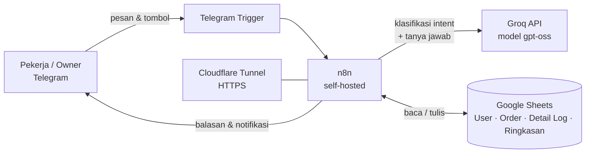
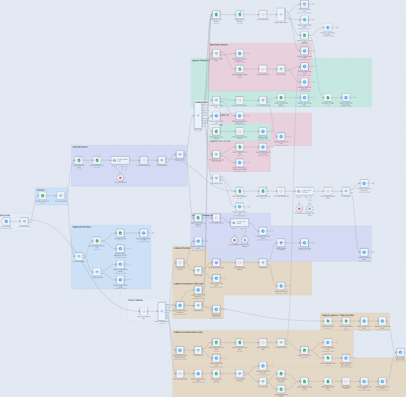
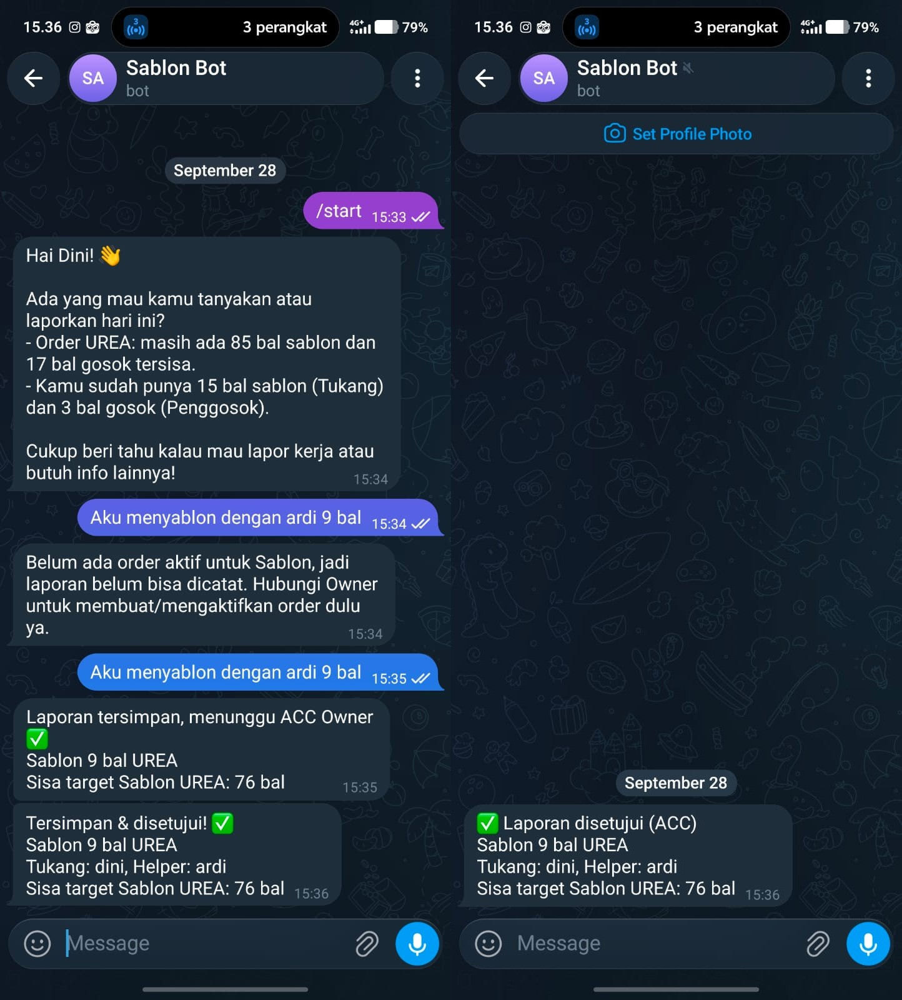
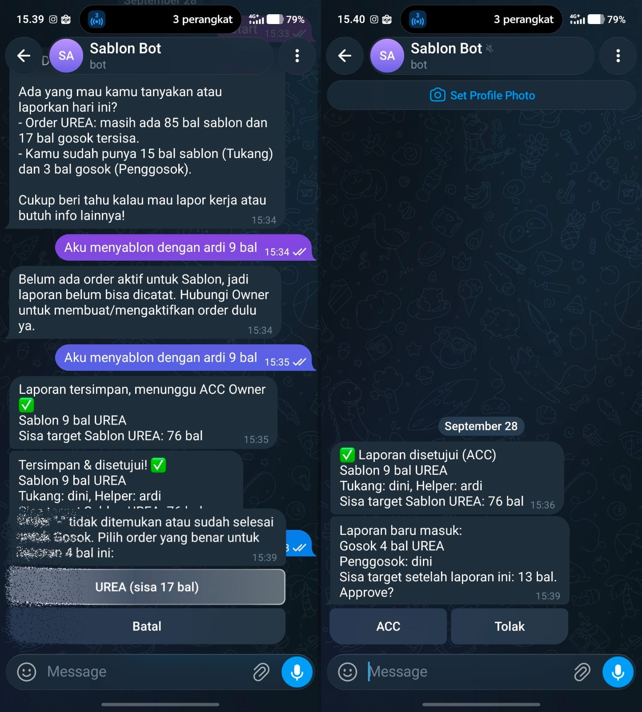

# Bot Telegram Pencatatan Sablon Karung

Bot Telegram berbasis **n8n + LLM (Groq)** untuk mencatat hasil kerja sablon dan gosok karung, lengkap dengan validasi order, persetujuan Owner, dan asisten AI untuk tanya-jawab data. Data disimpan otomatis di Google Sheets.

> Status: berjalan di server pribadi (self-hosted). Data pada screenshot dan template adalah data contoh.

## Masalah

Pencatatan hasil kerja dilakukan manual: pekerja melapor lewat chat biasa, lalu Owner menyalin angkanya ke spreadsheet. Akibatnya sulit melacak sisa target per order, rawan salah catat, dan Owner harus mengecek satu per satu.

## Solusi

Pekerja cukup mengetik dengan bahasa sehari-hari, misalnya `8 bal urea sama ardi` atau `gosok 15 bal urea`. Bot memahami maksudnya, mencocokkan ke order yang aktif, meminta konfirmasi, lalu mengirim laporan ke Owner untuk disetujui (ACC) sebelum dihitung sebagai realisasi.

## Fitur Utama

- **Pesan bebas, bukan perintah kaku.** LLM mengenali intent: lapor sablon, lapor gosok, cek progress, buat order, tutup order, setujui user, dan tanya data.
- **Validasi otomatis.** Bot mencocokkan jenis karung ke order aktif, menghitung sisa target, dan menolak laporan yang melebihi sisa. Kalau ada lebih dari satu order yang cocok, pekerja diminta memilih lewat tombol.
- **Alur persetujuan.** Laporan masuk berstatus `Pending`, Owner menekan ACC atau Tolak. Jika ditolak, baris dihapus dan target dikembalikan.
- **Role dan pendaftaran user.** Pengguna baru berstatus `Pending` sampai Owner menyetujui lewat tombol. Perintah tertentu (buat order, tutup order, tanya rekap) hanya untuk Owner.
- **Tutup order otomatis.** Cukup ketik `selesaikan ORD-001` atau `selesaikan urea`. Bot mencari order yang dimaksud sendiri.
- **Asisten AI untuk Owner.** Owner bisa bertanya bebas (rekap, kontribusi pekerja, perbandingan) dan meminta menambah, mengubah, atau menghapus data. AI hanya mengusulkan, perubahan baru dijalankan setelah Owner menekan tombol konfirmasi.
- **Asisten AI untuk Pekerja.** Pekerja bisa ngobrol dan menanyakan progress miliknya sendiri. Data pekerja lain tidak pernah dikirim ke model.

## Arsitektur



Diagram alur yang lebih rinci ada di [docs/architecture.md](docs/architecture.md).

## Keputusan Teknis

- **LLM hanya mengekstrak, sistem yang memutuskan.** Model hanya mengubah pesan menjadi JSON (intent, jumlah, nama karung). Pencocokan ke order, perhitungan sisa target, dan validasi dilakukan kode di n8n. Hasilnya lebih cepat, lebih murah, dan tidak bisa menebak order yang salah.
- **AI tidak menulis langsung ke database.** Untuk perubahan data lewat chat, AI mengeluarkan "usulan" berformat JSON. Kode memvalidasi nama kolom, memastikan baris yang dimaksud unik, dan melindungi kolom Role serta akun Owner. Setelah itu Owner harus mengonfirmasi lewat tombol. Usulan yang menunggu disimpan sementara dan kedaluwarsa dalam 30 menit.
- **Konfirmasi dua langkah** untuk semua aksi yang mengubah data (laporan, buat order, aksi dari asisten AI).
- **Privasi antar pekerja.** Konteks yang dikirim ke model untuk pekerja hanya berisi laporan milik pekerja itu sendiri. Nama rekan kerja dibuang sebelum masuk ke prompt.
- **Pemrosesan ACC yang aman diulang.** Sebelum menyetujui atau menolak, bot memeriksa bahwa laporan masih berstatus `Pending`, sehingga tombol yang ditekan dua kali tidak memproses data dua kali.
- **Efisiensi.** Untuk tutup order dan penyusunan konteks tanya-jawab, data order yang sudah dibaca di awal alur dipakai ulang tanpa membaca Sheets lagi. Model juga dibedakan menurut tugas: `gpt-oss-120b` untuk klasifikasi intent, `gpt-oss-20b` untuk chat.

## Tech Stack

| Bagian | Teknologi |
|---|---|
| Otomasi | n8n (self-hosted) |
| LLM | Groq, model `openai/gpt-oss-120b` dan `openai/gpt-oss-20b` |
| Antarmuka | Telegram Bot API (pesan, inline keyboard, callback query) |
| Penyimpanan | Google Sheets (API v4) |
| Hosting | Laptop bekas sebagai server, Docker, Coolify, Cloudflare Tunnel |
| Logika kustom | JavaScript di Code node |

## Struktur Repo

```
telegram-bot-sablon-karung/
├── README.md
├── .gitignore
├── workflow/
│   └── bot-telegram-sablon-karung.json   # workflow n8n (sudah dibersihkan dari kredensial)
├── docs/
│   ├── architecture.md                   # diagram alur rinci
│   ├── setup-guide.md                    # cara memasang dari nol
│   └── google-sheet-schema.md            # struktur sheet dan kolom
├── sheet-template/                       # header sheet + data contoh (CSV)
├── images/                               # screenshot dan GIF demo
└── scripts/
    └── sanitize_workflow.py              # pembersih kredensial sebelum commit
```

## Cara Menjalankan

Ringkasnya: siapkan Google Sheet dari template, ganti dua placeholder di file workflow, impor ke n8n, buat tiga kredensial (Telegram, Google Sheets, Groq), lalu aktifkan. Langkah lengkapnya ada di [docs/setup-guide.md](docs/setup-guide.md).

## Keamanan

- File workflow di repo ini **tidak berisi** token bot, API key, ID kredensial, atau ID Google Sheet. Semuanya diganti placeholder.
- Skrip [scripts/sanitize_workflow.py](scripts/sanitize_workflow.py) membersihkan dan memindai ekspor n8n sebelum di-commit.
- Akses fitur dibatasi per role di sisi workflow, bukan hanya lewat prompt.

## Screenshot

| Canvas n8n | Laporan dan konfirmasi | Persetujuan Owner |
|---|---|---|
|  |  |  |

## Hasil

> Isi bagian ini dengan hasil nyata dan jujur, misalnya jumlah pengguna, jumlah laporan yang tercatat, atau waktu yang dihemat. Kalau belum ada angkanya, hapus bagian ini.

## Rencana Pengembangan

- Merapikan alur `approve_user` lewat chat bebas. Saat ini jalur yang disarankan adalah tombol Terima/Tolak.
- Menambah pengujian otomatis untuk Code node yang berisi logika validasi.
- Notifikasi ringkasan harian untuk Owner.

## Pembuat

Nama kamu · [GitHub](https://github.com/USERNAME) · [LinkedIn](https://linkedin.com/in/USERNAME)
