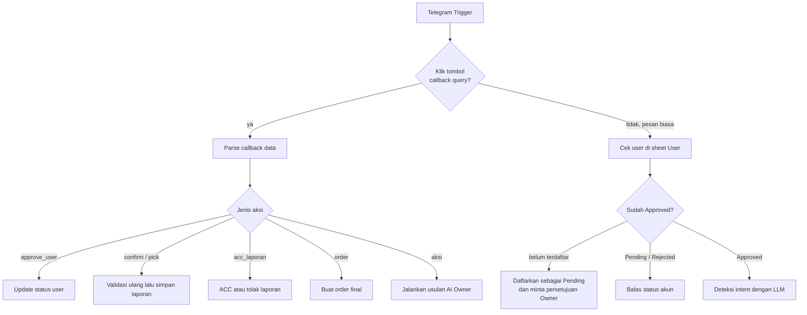
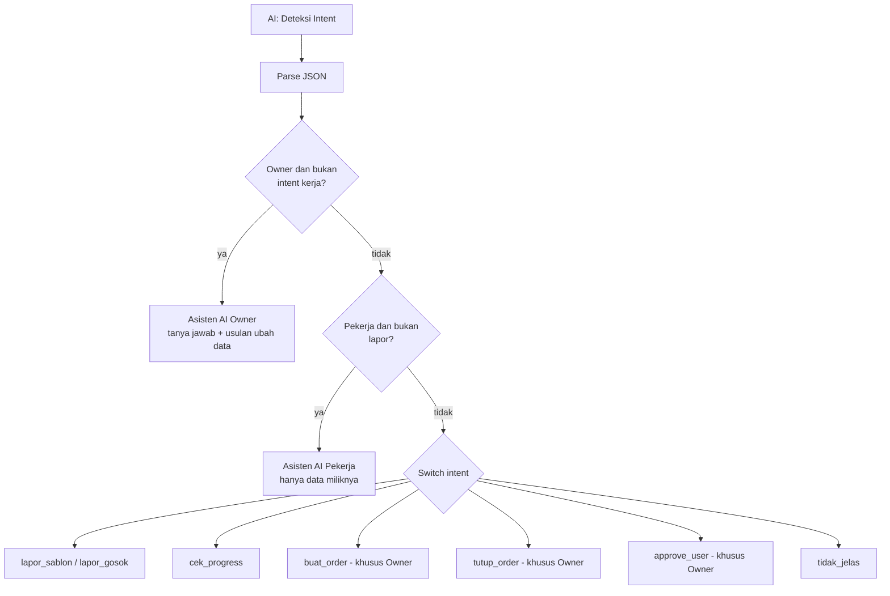
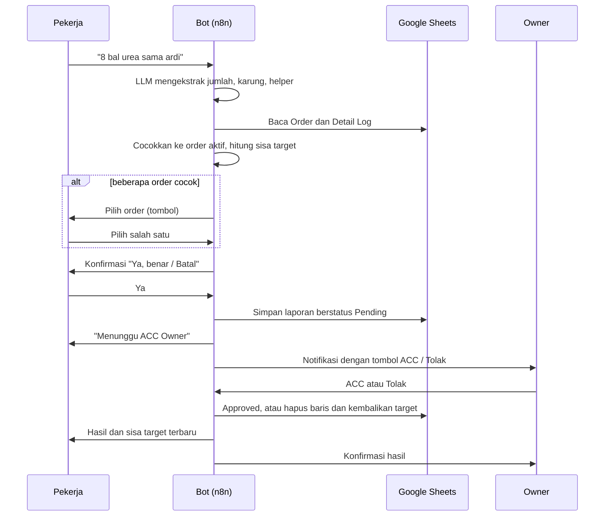
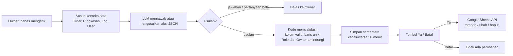

# Arsitektur dan Alur

Diagram di halaman ini memakai Mermaid, jadi tampil langsung di GitHub.

## 1. Pintu masuk: pesan atau tombol

Setiap update Telegram (pesan atau klik tombol) masuk lewat satu trigger, lalu dipisah menurut jenisnya.

## 2. Pemilihan jalur setelah intent terdeteksi

## 3. Alur laporan pekerja

Ini alur inti. Laporan tidak langsung dihitung, tetapi melewati konfirmasi pekerja dan persetujuan Owner.

## 4. Alur perubahan data lewat asisten AI Owner

AI tidak pernah menulis langsung. Ia hanya mengusulkan, dan kode yang memvalidasi serta mengeksekusi setelah konfirmasi.

## Pembagian model LLM

| Tugas | Model | Alasan |
|---|---|---|
| Deteksi intent | `openai/gpt-oss-120b` | Klasifikasi dan ekstraksi harus akurat karena hasilnya menentukan jalur |
| Asisten Owner | `openai/gpt-oss-20b` | Butuh respons cepat untuk tanya jawab |
| Asisten Pekerja | `openai/gpt-oss-20b` | Obrolan singkat dengan konteks kecil |

Memori percakapan memakai window 6 pesan terakhir, dipisah per chat.
